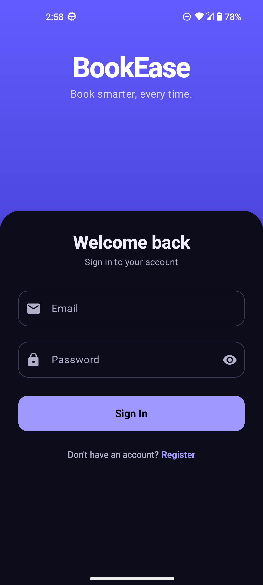
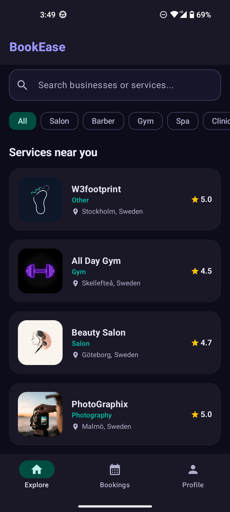
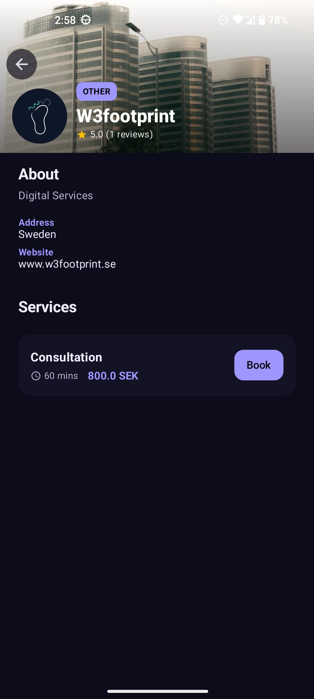
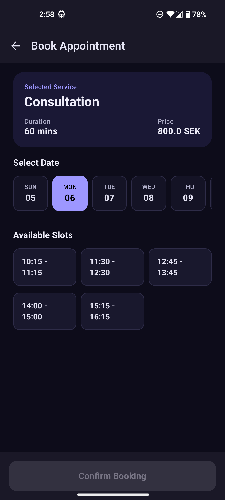
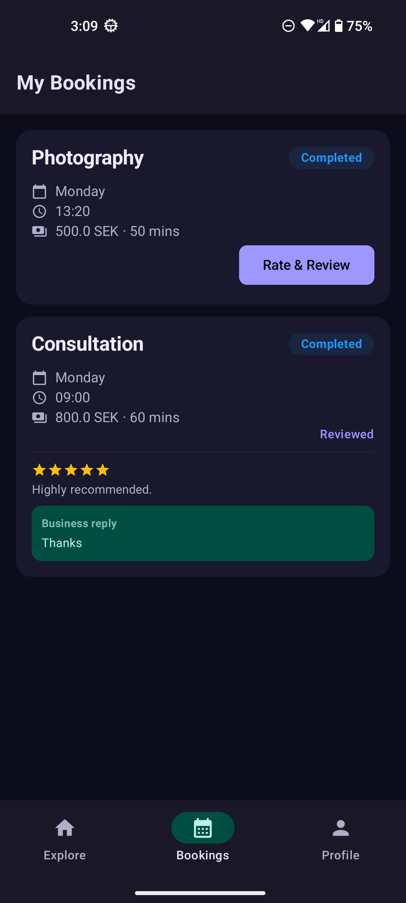

<div align="center">


# BookEase

**A full-stack Android booking platform connecting customers with local service businesses**


</div>

---

## Screenshots

<p align="center">
  
  
  
  
  
</p>

---

## Overview

BookEase is a two-sided marketplace app built entirely with modern Android tooling. Customers discover local businesses, book appointments in real time, and leave reviews. Business owners get a dedicated dashboard to manage services, control their schedule, and handle incoming bookings — all backed by Firebase.

The project covers the full product surface: authentication, real-time data, image handling, push notifications, role-based navigation, and a clean MVVM architecture with a domain layer separating business logic from both the UI and the data source.

---

## Features

### Customer
- Browse and search businesses by category (Salon, Gym, Spa, Clinic, and more)
- View business profile with cover photo, logo, description, and services
- Real-time slot availability based on the business's weekly schedule
- Book appointments — 14-day date picker, auto-generated time slots, conflict detection
- View, cancel, and manage booking history
- Rate completed bookings with a star rating and written review
- See business replies to reviews
- Profile management with photo upload

### Business Owner
- Dashboard with quick-action cards for all owner features
- Manage services: add, edit, and delete (name, price, duration)
- Set weekly opening hours per day with open/closed toggle
- Accept, reject, or mark bookings as completed
- View customer details on each booking
- Reply to customer reviews
- Full business profile: name, description, category, contact info, cover photo, logo
- Push notifications for new bookings and reviews (via Firebase Cloud Messaging)

---

## Tech Stack

| Layer | Technology |
|---|---|
| Language | Kotlin |
| UI | Jetpack Compose · Material Design 3 |
| Architecture | MVVM · Clean Architecture · UseCases |
| Dependency Injection | Hilt |
| Navigation | Jetpack Navigation Compose |
| Auth | Firebase Authentication |
| Database | Cloud Firestore |
| Push Notifications | Firebase Cloud Messaging · Cloud Functions (Node.js) |
| Image Loading | Coil · Base64 encoding for Firestore storage |
| Async | Kotlin Coroutines · StateFlow · SharedFlow |

---

## Architecture

The app follows Clean Architecture with a strict separation between three layers:

```
app/
├── data/
│   └── repository/           # Firebase implementations (Firestore, Auth, FCM)
├── domain/
│   ├── model/                # Pure Kotlin data classes (Appointment, Business, Review …)
│   ├── repository/           # Repository interfaces
│   └── use_case/             # Business logic isolated from UI
└── presentation/
    ├── features/
    │   ├── auth/             # Login · Register · Splash
    │   ├── customer/         # Home · Business Detail · Booking · History · Profile
    │   └── owner/            # Dashboard · Services · Schedule · Bookings · Reviews · Profile
    ├── navigation/           # Type-safe NavHost with role-based routing
    └── ui/components/        # Shared Compose components (cards, buttons, badges)
```

**Key design decisions:**
- Repository interfaces in the domain layer keep the domain free of Android and Firebase dependencies
- `StateFlow` drives all UI state; `SharedFlow` handles one-shot events (navigation, toasts)
- Images are Base64-encoded and stored directly in Firestore to avoid Firebase Storage configuration overhead
- Booking slot generation is done client-side from opening hours, with Firestore used only to check existing bookings for conflict detection
- Role-based navigation (`Customer` vs `Business`) is resolved at the Firestore level after login, with full back-stack clearing to prevent returning to the auth screens

---

## Getting Started

### Prerequisites
- Android Studio Hedgehog or newer
- A Firebase project with **Authentication** and **Firestore** enabled
- Android device or emulator running API 24+

### Setup

1. Clone the repository
   ```bash
   git clone https://github.com/alab2296/bookease.git
   ```

2. Add your `google-services.json` from the Firebase Console into the `app/` directory

3. In Firebase Console, enable:
   - **Authentication** → Email/Password sign-in
   - **Cloud Firestore** → Start in test mode (then lock down rules before production)

4. Open the project in Android Studio and run on your device

### Push Notifications (optional)

Push notifications use Firebase Cloud Functions. Deploying them requires the Firebase **Blaze** (pay-as-you-go) plan:

```bash
cd functions
npm install
firebase deploy --only functions
```

---

## Related

[**BookEase Blockchain**](https://github.com/w3footprint/bookease-blockchain) — a companion project exploring the same booking domain with a different architecture: trustless payment escrow via an Ethereum smart contract (Solidity · React · Hardhat). No backend, no platform — just code enforcing the rules.

---

<div align="center">

Built by [Ali Abdullah](https://github.com/alab2296) · W3Footprint · Sweden

</div>
